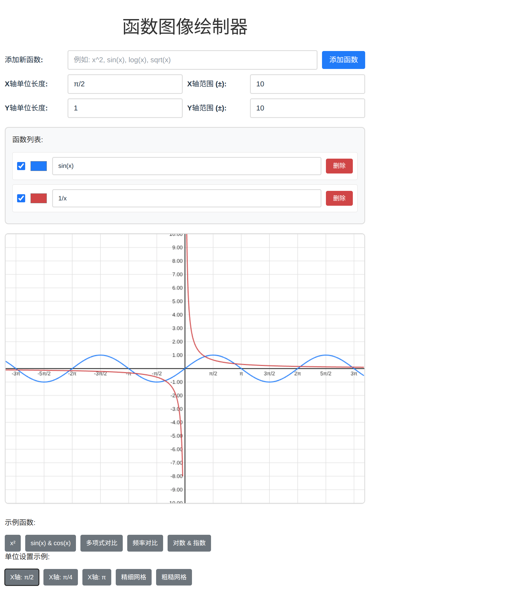

# 函数图像绘制器 (Function Plotter)

一个基于React的交互式数学函数图像绘制工具，支持多函数同时绘制、自定义坐标轴单位和智能标签显示。

[在线预览](https://mindfulcoder.github.io/function-plotter/)



## 🌟 功能特性

### 📊 核心功能
- **多函数绘制**：支持同时绘制多个函数图像，每个函数独立配色
- **实时渲染**：输入函数表达式后实时显示图像
- **交互式控制**：可以单独控制每个函数的显示/隐藏
- **智能坐标系**：支持自定义坐标轴单位长度和显示范围

### 🎨 用户界面
- **函数管理**：添加、删除、编辑函数表达式
- **颜色定制**：为每个函数选择独特的颜色
- **预设示例**：提供常用函数和设置的快速选择
- **响应式设计**：支持桌面和移动设备

### 🔢 数学支持
- **基本初等函数**：多项式、三角函数、对数、指数、根式等
- **复合函数**：支持复杂的数学表达式组合
- **π单位支持**：坐标轴可使用π/2、π/4等作为单位长度
- **智能标签**：自动简化显示（如4π/2显示为2π）

## 🚀 快速开始

### 安装依赖
```bash
npm install
```

### 启动开发服务器
```bash
npm run dev
```

### 构建生产版本
```bash
npm run build
```

## 📖 使用指南

### 基本操作

1. **添加函数**
   - 在"添加新函数"输入框中输入数学表达式
   - 点击"添加函数"按钮或按回车键
   - 函数将自动分配颜色并显示在图像中

2. **管理函数**
   - 使用复选框控制函数的显示/隐藏
   - 点击颜色块更改函数颜色
   - 直接编辑表达式进行实时修改
   - 点击"删除"按钮移除不需要的函数

3. **调整坐标系**
   - 设置X/Y轴的单位长度（支持π表达式）
   - 调整坐标轴的显示范围
   - 使用预设按钮快速应用常用设置

### 支持的函数类型

| 类型 | 示例 | 说明 |
|------|------|------|
| 多项式 | `x^2`, `x^3 + 2*x - 1` | 幂函数和多项式 |
| 三角函数 | `sin(x)`, `cos(x)`, `tan(x)` | 基本三角函数 |
| 反三角函数 | `asin(x)`, `acos(x)`, `atan(x)` | 反三角函数 |
| 对数函数 | `log(x)`, `log10(x)` | 自然对数和常用对数 |
| 指数函数 | `exp(x)`, `2^x` | 指数函数 |
| 根式函数 | `sqrt(x)`, `x^(1/3)` | 平方根和立方根 |
| 绝对值 | `abs(x)` | 绝对值函数 |
| 复合函数 | `sin(x^2)`, `log(abs(x))` | 函数的复合 |

### 坐标轴单位设置

支持以下单位格式：
- **数值**：`1`, `0.5`, `2`
- **π表达式**：`π`, `π/2`, `π/4`, `π/3`, `π/6`
- **数学表达式**：`2*π/3`, `π/8`

### 预设示例

#### 函数示例
- **x²**：基本二次函数
- **sin(x) & cos(x)**：三角函数对比
- **多项式对比**：x²、x³、√x的形状对比
- **频率对比**：不同频率的正弦函数
- **对数 & 指数**：互为反函数的对比

#### 单位设置示例
- **X轴: π/2**：适合观察三角函数周期
- **X轴: π/4**：更精细的三角函数观察
- **精细网格**：0.5单位的精细网格
- **粗糙网格**：2单位的粗糙网格

## 🏗️ 项目架构

### 技术栈
- **React 19.1**：前端框架
- **Math.js**：数学表达式解析和计算
- **HTML5 Canvas**：图形绘制
- **CSS3**：样式和响应式布局

### 组件架构

```
src/
├── components/           # React组件
│   ├── AxisControls.jsx  # 坐标轴控制组件
│   ├── Canvas.jsx        # 画布容器组件
│   ├── ExampleButtons.jsx # 示例按钮组件
│   ├── FunctionInput.jsx # 函数输入组件
│   ├── FunctionItem.jsx  # 单个函数项组件
│   └── FunctionList.jsx  # 函数列表组件
├── hooks/               # 自定义Hook
│   └── useMathParser.js # 数学解析Hook
├── utils/               # 工具函数
│   ├── canvasRenderer.js # Canvas渲染器
│   └── labelFormatter.js # 标签格式化工具
├── App.jsx              # 主应用组件
├── App.css             # 样式文件
└── main.jsx            # 应用入口
```

### 设计原则

#### 单一职责原则
每个组件都有明确的单一职责：
- **FunctionInput**：处理新函数输入
- **AxisControls**：管理坐标轴设置
- **FunctionList**：管理函数列表展示
- **CanvasRenderer**：负责图形绘制逻辑

#### 组件化设计
- **可重用性**：组件可在其他项目中复用
- **可维护性**：修改某个功能不影响其他部分
- **可测试性**：每个组件可独立测试

#### 关注点分离
- **UI组件**：专注于用户界面展示
- **业务逻辑**：封装在Hook和工具类中
- **数据管理**：集中在主组件中

## 🎯 核心算法

### 坐标转换
```javascript
// 数学坐标到Canvas坐标的转换
toCanvasX = (x) => ((x - xMin) / (xMax - xMin)) * canvasWidth
toCanvasY = (y) => canvasHeight - ((y - yMin) / (yMax - yMin)) * canvasHeight
```

### 函数绘制
```javascript
// 采样绘制算法
const step = (xMax - xMin) / canvasWidth;
for (let x = xMin; x <= xMax; x += step) {
  const y = evaluate(expression, { x });
  // 绘制点连线
}
```

### 智能标签格式化
- 优先显示最简形式（如2π而不是4π/2）
- 支持π的各种分数形式
- 自动处理浮点数精度问题

## 🎨 样式设计

### 色彩方案
- **主色调**：蓝色系 (#007bff)
- **辅助色**：红、绿、黄、紫等8种预定义颜色
- **背景色**：浅灰色网格 (#ddd)
- **坐标轴**：深灰色 (#333)

### 响应式设计
- **桌面端**：横向布局，完整功能展示
- **移动端**：纵向布局，触摸友好的控件

### 用户体验
- **实时反馈**：输入即时生效
- **视觉层次**：清晰的信息架构
- **操作便捷**：键盘快捷键支持

## 🔧 配置选项

### 画布设置
- **尺寸**：800×600像素
- **坐标范围**：可自定义X/Y轴范围
- **网格密度**：根据单位长度自动调整

### 函数设置
- **最大函数数量**：无限制
- **颜色循环**：8种颜色自动循环分配
- **表达式验证**：实时语法检查

## 🚧 未来规划

### 功能增强
- [ ] 函数导数和积分可视化
- [ ] 参数方程支持
- [ ] 极坐标函数绘制
- [ ] 3D函数图像支持

### 用户体验
- [ ] 图像缩放和平移
- [ ] 函数表达式历史记录
- [ ] 图像导出功能
- [ ] 键盘快捷键扩展

### 技术优化
- [ ] WebGL渲染加速
- [ ] 函数计算优化
- [ ] 内存使用优化
- [ ] 单元测试覆盖

## 📄 许可证

MIT License

## 🤝 贡献指南

欢迎提交Issue和Pull Request来改进这个项目！

### 开发环境设置
1. Fork本仓库
2. 创建功能分支：`git checkout -b feature/new-feature`
3. 提交更改：`git commit -am 'Add new feature'`
4. 推送分支：`git push origin feature/new-feature`
5. 创建Pull Request

### 代码规范
- 使用ESLint进行代码检查
- 遵循React Hooks最佳实践
- 保持组件的单一职责原则
- 添加适当的注释和文档

---

**享受数学函数的可视化之旅！** 🎉